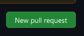

## Hola este es mi ejercicio de examen
**hola este es mi examen**

# 1.Vamos arriba a la derecha y le damos al al mas y creamos un nuevos repositorio, En la caja de la decripcion ponemos un descripcion corta y por ultimos le damos a que el repositorio sea publico o privado y añadimos un Readme.md al final le damos a crear repositorio

# 2.De nombre de repositorio ponemos hello-world-examen

# 3.Clicamos donde pone rama main y creamos una nueva que se llama readme-edits

# 4.1.Clicamosen el Readme.md de la rama readme-edits y le damos a editar

# 4.2.Cuando estamos con el modo editor escribimos unas cuanteas cosas poniendo diferentes estilos de markdown cuando los pongamos ponemos en la caja de commit changes una descripcion y le damos al boton de commit changes para finalizar

# 5.1.Clicamos en el pull recuest de la rama hello-world-examen y clicamos new pull request

# 5.2.Ahora comparamos el readme-edits con la rama main que es la original y Revisamos los cambios en los diffs de la página para asegúrar que sean lo que queriamos enviar y le damos a create pull request.

#5.3.Cuando le damos a create pull request escribimos una pequeña descripcion y finalmente le damos a crear

#6.1.Cuando tengamos creada el pull request nos aparecera un comentario con un boton que pone merge pull request clicamos el boton y luego le damos a confirm merge nos aparecera un mensaje y como ahora las ramas se han combinadolos cambios estaran en el main y le podemos dar a eliminar la rama que habiamos creado con anterioridad

